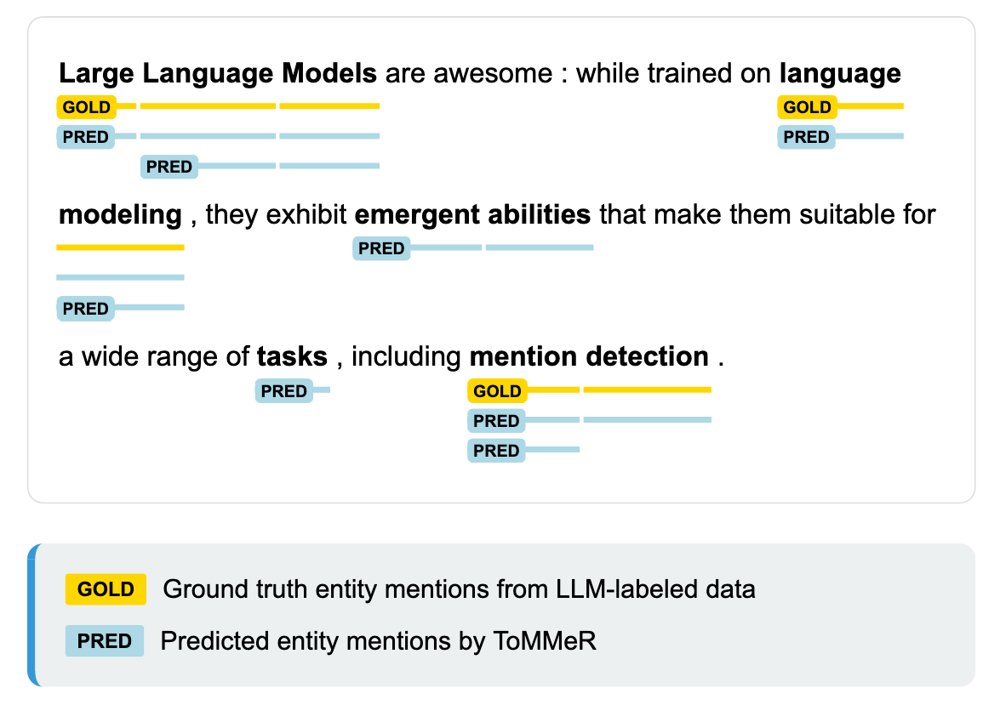

# ToMMeR – Efficient Entity Mention Detection from Large Language Models

### Abstract
> _Identifying which text spans refer to entities --  mention detection -- is both foundational for information extraction and a known performance bottleneck. We introduce ToMMeR, a lightweight model (<300K parameters) probing mention detection capabilities from early LLM layers. Across 13 NER benchmarks, ToMMeR achieves 93\% recall zero-shot, with over 90\% precision using an LLM as a judge showing that ToMMeR rarely produces spurious predictions despite high recall. Cross-model analysis reveals that diverse architectures (14M-15B parameters) converge on similar mention boundaries (DICE >75\%), confirming that mention detection emerges naturally from language modeling.  When extended with span classification heads, ToMMeR achieves near SOTA NER performance (80-87\% F1 on standard benchmarks). Our work provides evidence that structured entity representations exist in early transformer layers and can be efficiently recovered with minimal parameters._

## Overview

<p align="center">
    
</p>

**Figure 1:**  ToMMeR is a lightweight probing model extracting emergent mention detection capabilities from early layers representations of any LLM backbone, achieving high Zero Shot recall across a wide set of 13 NER benchmarks.

## Installation

### Using Pip

```bash
uv pip install -e git+https://github.com/VictorMorand/llm2ner.git
```


### Local install for Dev 

#### Using `uv`

We suggest using [uv](https://docs.astral.sh/uv/), a super fast package manager.
The following commands will clone the repo and install it within a new ready-to-use `.venv` with all dependencies.
```bash
git clone https://github.com/VictorMorand/llm2ner.git
cd llm2ner
uv sync
```

## Usage

###
```python
import llm2ner
from llm2ner import ToMMeR

tommer = ToMMeR.from_pretrained("llm2ner/saved_models/ToMMeR-Llama-3.2-1B_L6_R64")
# load Backbone llm, optionnally cut the unused layer to save GPU space.
llm = llm2ner.utils.load_llm( tommer.llm_name, cut_to_layer=tommer.layer,) 
tommer.to(llm.device)

text = "Large language models are awesome. While trained on language modeling, they exhibit emergent Zero Shot abilities that make them suitable for a wide range of tasks, including Named Entity Recognition (NER). "

#fancy interactive output
outputs = llm2ner.plotting.demo_inference( text, tommer, llm,
    decoding_strategy="threshold",  # or "greedy" for flat segmentation
    threshold=0.5, # default 50%
    show_attn=True,
)
```

### Demo 
The [`ToMMeR_Demo.ipynb`](./Notebooks/ToMMeR_Demo.ipynb) notebook enables you to quickly test the models.


### Running experiments

[Experimaestro](https://github.com/experimaestro/experimaestro-python) is used to launch and monitor experiments.
You can run an experiment training a ToMMeR Model on the specified Dataset with the following command:

```bash
uv run experimaestro run-experiment experiments/trainTokenMatching
```

## Acknowledgements

We depend on several key packages:
- [`experimaestro-python`](https://github.com/experimaestro/experimaestro-python) for experiment management.
- [`transformer-lens`](https://github.com/TransformerLensOrg/TransformerLens) can be used for wrapping LLMs in a generic `HookedTransformer` class with a unified nomencature for placing Hooks. It is build upon the hugginface `transformers` library.

## Citation

If you find this work useful, please cite the associated publication:
```
```
