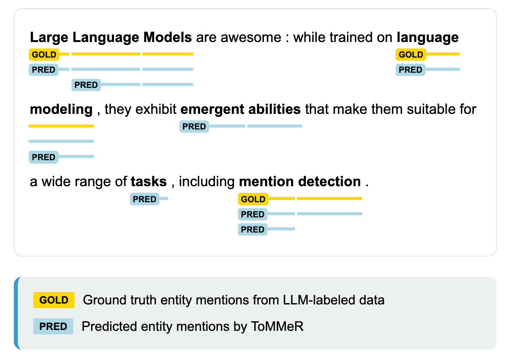

<div align="center">

<h1>ToMMeR – Efficient Entity Mention Detection from Large Language Models</h1>
<div>
    <a href='https://victormorand.github.io/' target='_blank'>Victor Morand</a><sup>1</sup>&emsp;
    <a target='_blank'>Nadi Tomeh</a><sup>2</sup>&emsp;
    <a href='https://scholar.google.com/citations?user=V-Nyr0wAAAAJ' target='_blank'>Josiane Mothe</a><sup>3</sup>&emsp;
    <a href='https://www.piwowarski.fr' target='_blank'>Benjamin Piwowarski</a><sup>1</sup>&emsp;
</div>
<br>
<div>
    <sup>1</sup>Sorbonne Université, CNRS, ISIR, F-75005 Paris, France&emsp;<br>
    <sup>2</sup>LIPN, Université Sorbonne Paris Nord, UMR7030 CNRS&emsp;<br>
    <sup>3</sup>IRIT, Université de Toulouse, UMR5505 CNRS, F-31400 Toulouse, France&emsp;<br>
</div>
<br>

[](https://arxiv.org/abs/2510.19410)
[](https://github.com/VictorMorand/llm2ner)


</div>

ToMMeR is a lightweight probing model extracting emergent mention detection capabilities from early layers representations of any LLM backbone, achieving high Zero Shot recall across a wide set of 13 NER benchmarks.


### Abstract
> _Identifying which text spans refer to entities -  mention detection - is both foundational for information extraction and a known performance bottleneck. We introduce ToMMeR, a lightweight model (<300K parameters) probing mention detection capabilities from early LLM layers. Across 13 NER benchmarks, ToMMeR achieves 93\% recall zero-shot, with over 90\% precision using an LLM as a judge showing that ToMMeR rarely produces spurious predictions despite high recall. Cross-model analysis reveals that diverse architectures (14M-15B parameters) converge on similar mention boundaries (DICE >75\%), confirming that mention detection emerges naturally from language modeling.  When extended with span classification heads, ToMMeR achieves near SOTA NER performance (80-87\% F1 on standard benchmarks). Our work provides evidence that structured entity representations exist in early transformer layers and can be efficiently recovered with minimal parameters._

## Installation

### Using Pip

```bash
uv pip install -e git+https://github.com/VictorMorand/llm2ner.git
```


### Local install for Dev 

#### Using `uv`

We suggest using [uv](https://docs.astral.sh/uv/), a super fast package manager.
The following commands will clone the repo and install it within a new ready-to-use `.venv` with all dependencies.
```bash
git clone https://github.com/VictorMorand/llm2ner.git
cd llm2ner
uv sync
```

## Usage


Please see [`ToMMeR_Demo.ipynb`](./Notebooks/ToMMeR_Demo.ipynb) notebook enables you for examples 
[](https://colab.research.google.com/github/VictorMorand/llm2ner/blob/main/Notebooks/ToMMeR_Demo.ipynb)

### Running experiments

[Experimaestro](https://github.com/experimaestro/experimaestro-python) is used to launch and monitor experiments.
You can run an experiment training a ToMMeR Model on the specified Dataset with the following command:

```bash
uv run experimaestro run-experiment experiments/trainTokenMatching
```

## Acknowledgements

We depend on several key packages:
- [`experimaestro-python`](https://github.com/experimaestro/experimaestro-python) for experiment management.
- [`transformer-lens`](https://github.com/TransformerLensOrg/TransformerLens) can be used for wrapping LLMs in a generic `HookedTransformer` class with a unified nomencature for placing Hooks. It is build upon the hugginface `transformers` library.

## Citation

If you find this work useful, please cite the associated paper:
```yaml
@misc{morand2025tommerefficiententity,
      title={ToMMeR -- Efficient Entity Mention Detection from Large Language Models}, 
      author={Victor Morand and Nadi Tomeh and Josiane Mothe and Benjamin Piwowarski},
      year={2025},
      eprint={2510.19410},
      archivePrefix={arXiv},
      primaryClass={cs.CL},
      url={https://arxiv.org/abs/2510.19410}, 
}
```
